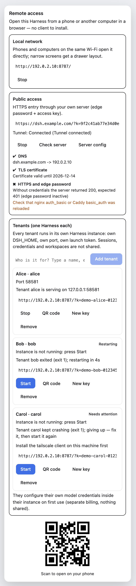

# Multi-tenancy: one gateway, one Harness per person

[English](multi-tenant.md) | [中文](multi-tenant.zh.md)

> **Read this first.** Every tenant's Harness runs **on the machine where you installed this
> plugin**, and a Harness can execute commands and touch files there. Giving someone a tenant link
> is therefore equivalent to giving them an account on that computer. Do this only for people you
> would let sit down at it.
>
> If someone just wants their own remote entry, the right answer is the cheap one: **they install
> this plugin on their own machine** (MIT, `npx dsh-plugin-remote-connect serve --public ...`). That
> is what this project is built for; the multi-tenant layer below exists for the case where one
> machine really does serve several people (a home lab, a shared workstation, a family box), and it
> is off by default.

A DSH Harness instance is **single-user by construction**: its sessions, credentials, settings,
workspace and launch token all live inside one `DSH_HOME`. There is no account system inside it
(the shipped `anonymous-user-id` is a telemetry UUID, not an identity). So multi-tenancy cannot be
a switch on one instance — it is this plugin acting as a **gateway** and giving every tenant
**their own Harness process**:

```
                         ┌─ tenant alice ─► Harness 127.0.0.1:58581   DSH_HOME=~/DSH-tenants/alice
browser ─?k=<alice key>─►│                 (own sessions / credentials / token)
   gateway :8787/:8788   └─ tenant bob   ─► Harness 127.0.0.1:58582   DSH_HOME=~/DSH-tenants/bob
```

What is isolated, and by what:

| Thing | Boundary |
| --- | --- |
| Sessions, settings, credentials, `storages/` | separate `DSH_HOME` per tenant (separate directories) |
| Process, memory, agent loop | separate OS process per tenant |
| Launch token | each instance prints its own; the gateway injects **only** that tenant's token |
| Network exposure | every instance binds `127.0.0.1` only; the only way in is the gateway |
| Model billing / API keys | each tenant configures their own credentials inside their instance — nothing is inherited |

Verified end to end in `test/e2e-isolated.sh`: two real instances on separate loopback ports with
separate `DSH_HOME`s, each key routed to its own instance, anonymous requests and unknown keys
answered with `404`, and **one tenant's launch token against the other tenant's port → `401`**.

---



## Turn it on

```yaml
# profiles/web/cordis.patch.yml
- insert:
    - id: dsh-plugin-remote-connect
      name: dsh-plugin-remote-connect
      config:
        lan: { enabled: true, port: 8787 }
        tenants:
          enabled: true
          baseDir: ~/DSH-tenants          # one DSH_HOME per tenant goes here
          registry: ~/.dsh/remote-connect/tenants.json
          harness:
            node: /opt/homebrew/bin/node  # a REAL node, see the gotcha below
```

Restart DSH, open the panel: there is now a **Tenants** card. Add a person by name, press the QR
button, and send them that link. That is the whole flow — the link carries their access key, the
gateway exchanges it for a cookie, and every request from then on lands in *their* Harness.

⚠️ **One gotcha that costs an hour if you skip it.** DSH Desktop puts its own `node` shim in `PATH`
(`ELECTRON_RUN_AS_NODE=1` + the Electron helper). That shim rejects `NODE_OPTIONS`, so the tenant
instances never boot if you point `harness.node` at it. Use a real Node (Homebrew's is fine) — the
panel says so explicitly when it cannot start them, and `tenants.harness.bin` can pin the Harness
entry point if auto-detection picks the wrong one.

---

## Command line

```bash
# registry editing (does NOT start anything)
npx dsh-plugin-remote-connect tenant add --name "Alice"      # prints the key + LAN link + QR
npx dsh-plugin-remote-connect tenant list
npx dsh-plugin-remote-connect tenant key    --id alice
npx dsh-plugin-remote-connect tenant rotate alice            # old links die immediately
npx dsh-plugin-remote-connect tenant rm     alice            # data directory is left in place

# run the gateway + the instances in this process (for machines without a DSH UI)
npx dsh-plugin-remote-connect serve --multi --port 8787
```

`tenant` only edits the registry. The Harness instances belong to whichever process runs the
gateway — the DSH plugin, or `serve --multi`. Start/stop them from the host window panel (`serve
--multi` stops them when it exits), because an instance started by a short-lived CLI command would
be orphaned the moment that command returned.

---

## Registry format

`~/.dsh/remote-connect/tenants.json`, mode `0600`, written atomically:

```json
{
  "version": 1,
  "tenants": [
    {
      "id": "alice",                    // 2–32 lowercase letters/digits/hyphens; also the DSH profile name
      "name": "Alice",
      "accessKey": "…32 url-safe chars…",
      "home": "/home/you/DSH-tenants/alice",
      "profile": "alice",
      "port": 0,                        // 0 = let the OS pick; the real port is read from the instance
      "autostart": true,
      "enabled": true,
      "note": "",
      "createdAt": "2026-09-19T03:44:53.370Z"
    }
  ]
}
```

Hand-editing is fine: invalid entries are reported and skipped (the plugin still boots), and
duplicate ids or duplicate access keys are rejected so two tenants can never share a key.

---

## Operating notes

| Question | Answer |
| --- | --- |
| Where do I see what a tenant's instance is doing? | `<tenant home>/instance.log` (its stdout/stderr), and the per-tenant state in the panel |
| A tenant's instance keeps crashing | the supervisor retries with exponential backoff, then stops and shows the last error instead of looping forever |
| I rotated a key | old `?k=` links stop working immediately; already-issued cookies for that tenant stop matching |
| I removed a tenant | the instance is stopped and unregistered; **their data directory is not deleted** |
| Two people on one laptop | one browser profile each (the cookie decides the tenant) |
| Public entry | each tenant gets `https://<your-domain>/?k=<their key>`; the edge password still applies to everyone |
| Can a tenant reach another tenant's instance? | no: the gateway only ever connects to the upstream resolved from *that* request's cookie, and instances accept only their own token |
| Do tenants share my API credentials? | no — by design each instance has its own credentials file. Give them their own key, or copy yours deliberately if you want to pay for them |
